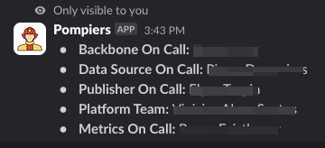

# :fire_engine: Pompiers

Pompiers os a slack slash command app.

It will fetch the currently on call people on each team and list them as the command response.

We used to have a `/oncall` command with BetterStack that would list all users on call. Since Compass does not provide that unless all users ar paid users, we created this service to provide the same command via a custom Slack APP.

## App management

The slack app can be found [here](https://api.slack.com/apps/A08L24JPJFR).